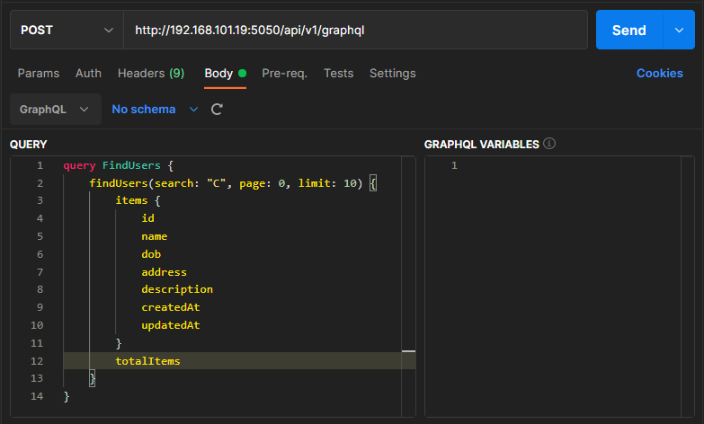
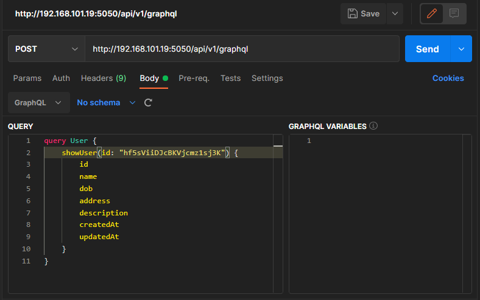
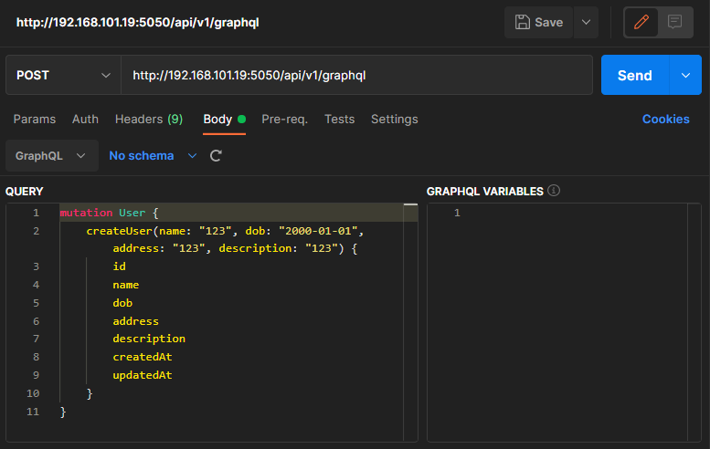
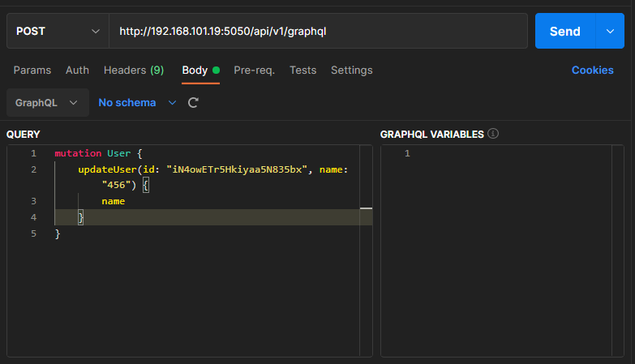
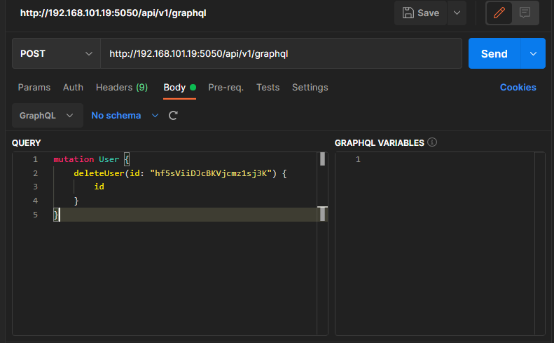

# Superformula Code Challenge API Server

## Framework

This app is based on HapiJS.

## Database

This app uses AWS DynamoDB.

The AWS account is required to run this app.

Please fill `AWS_REGION`, `AWS_ACCESS_KEY_ID` and `AWS_SECRET_ACCESS_KEY` in `.env` file.

## Architectural Style

This app builds API based on GraphQL not REST.

## CRUD Test

You can use Postman to test this app.

### Find (query)

### Show (query)

### Create (mutation)

### Update (mutation)

The output fields must be the same as the input fields. If the output contains the any other fields else the input, you will get `null` value about them.

### Delete (mutation)

This mutation returns only `id` field.

